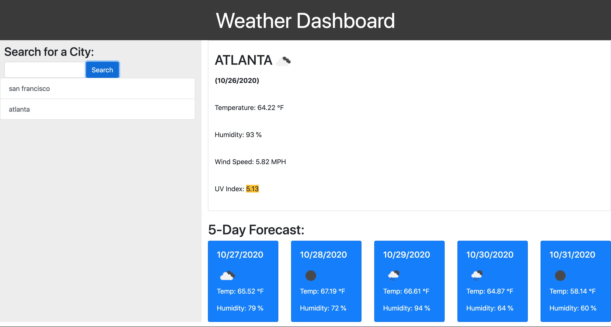

# Weather Dashboard

## This Repository
In this repository you will find the code pertaining to a [Weather Dashboard](https://gusmor94.github.io/weather-dashboard/) application. The weather dashboard uses the OpenWeather API to display current weather for a searched city, as well as a 5-day forecast for that city. When the current weather is displayed, the user will be presented with a color for the UV Index, that will change depending on the weather conditions. Once a city is searched, a search history will be created in the left side column, and the user will be able to click on any of those previous cities to revisit the weather for a specific city. 

Eventually, I would like to add a feature where the user can reload the page, and localStorage will be used to load the search history onto the page. 

## Resources 
Other third-party resources that were used for this application are: 
* Bootstrap CSS
* Moment.js

Below is screenshot of the current working version of the weather dashboard: 

 